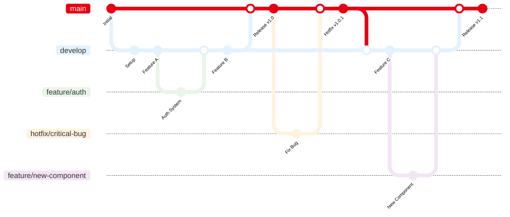

<div align="center">

# Portfolio

      

A modern professional developer portfolio Built with **Next.js** following a **JAMstack architecture**, leveraging **static site generation** for optimal performance and deployed automatically on **Vercel**.

</div>

## ✨ Features

- Professional first impression with clear value proposition
- Comprehensive project showcase with detailed case studies
- Professional background and skills evaluation system
- Responsive mobile-optimized experience across all devices
- Simple contact system with professional networking links

## 🛠️ Tech Stack

This portfolio follows JAMstack architecture principles with modern tooling for optimal performance, maintainability, and developer experience:

| **Category** | **Technology** | **Version** | **Role** | **Why This Choice** |
|--------------|----------------|-------------|----------|-------------------|
| **🖥️ Frontend** |  | 15.0 | React framework with App Router | SSG capabilities, performance, modern routing |
| |  | 18+ | UI library | Mature ecosystem, reusable components |
| |  | 4 | Utility-first CSS framework | Rapid development, consistent design system |
| |  | Latest | Icon system | Lightweight, optimized SVGs, tree-shaking |
| **⚙️ Business Logic** |  | - | State management | Simple, performant state handling |
| |  | - | Reusable logic | Clean separation of concerns |
| |  | - | Modern JavaScript modules | Native standards, optimization |
| **🔧 Development Tools** |  | 18+ | JavaScript runtime | npm ecosystem, modern tooling |
| |  | 8+ | Package manager | Performance, disk space efficiency |
| |   | Latest | Code quality | Consistent coding standards |
| **🚀 Services & APIs** |  | - | Form handling | No backend required, spam protection |
| |  | v4 | Repository data | Dynamic project information |
| |  | - | Performance monitoring | Privacy-friendly, built-in |
| **📦 CI/CD & Deployment** |  | - | CI/CD pipeline | Native integration, automated workflows |
| |  | - | Hosting and deployment | Edge network, preview deployments |
| |  | - | Version control | Collaboration, history tracking |
| **📄 Content Management** |   | - | Content format | Rich content, component embedding |
| |  | - | Configuration | Type-safe, easy maintenance |
| |  | - | Content management | Version control, developer-friendly |


## 📋 Prerequisites

- **Node.js** 18+ (LTS recommended)
- **pnpm** 8+ (package manager)
- **Git** (version control)
- **GitHub Account** (for GitHub Actions)
- **Vercel Account** (for deployment)

## 🚀 Quick Start

```bash
# Clone repository
git clone https://github.com/sikatikenmogne/portfolio.git
cd portfolio

# Install dependencies
pnpm install

# Start development server
pnpm run dev
# → Open http://localhost:3000

# Build for production
pnpm run build

# Start production server
pnpm run start
```

## 📖 Preview

<details>
<summary><strong>Portfolio Screenshots</strong></summary>

### Desktop View


### Mobile View


### Dark Mode


</details>

## 🏗️ Project Structure

```
portfolio/
├── .github/workflows/     # GitHub Actions CI/CD
├── src/
│   ├── app/              # Next.js App Router (pages & layouts)
│   ├── components/       # Reusable React components
│   │   ├── navigation/   # Header, footer, navigation
│   │   ├── projects/     # Project cards, filters, details
│   │   ├── profile/      # About, skills, experience
│   │   ├── contact/      # Contact form, social links
│   │   └── shared/       # Layout, SEO, error boundaries
│   ├── hooks/            # Custom React hooks
│   ├── lib/              # Utility functions and services
│   └── data/             # Configuration and static data
├── content/              # Git-based CMS (Markdown files)
│   ├── projects/         # Project case studies
│   ├── blog/             # Technical articles
│   └── profile/          # About, experience, education
├── public/               # Static assets (images, icons, docs)
├── scripts/              # Build and utility scripts
├── .env.example          # Environment variables template
└── next.config.mjs       # Next.js configuration
```

## 🚧 Project Status

This portfolio is currently under active development. Some features may be incomplete or under implementation.

### Development Progress

- [x] User Interface
- [x] Navigation System
- [x] Contact Form
- [x] Dark/Light Theme
- [x] Projects Showcase
- [x] Technical Blog
- [x] Automated Testing
- [x] Internationalization

**Last Update:** September 2025

## 🤝 Contributing

This project follows the [Contributor Covenant](https://www.contributor-covenant.org/) code of conduct.
By participating, you are expected to uphold this code.

### 🔄 How to Contribute

1. Fork the project
2. Create a branch (`git checkout -b feature/improvement`)
3. Commit using conventional commits (`git commit -m 'feat: add improvement'`)
4. Push (`git push origin feature/improvement`)
5. Open a Pull Request

### 📝 Commit Convention

This project uses [Conventional Commits](https://www.conventionalcommits.org/) specification for commit messages. This leads to more readable messages that are easy to follow when looking through the project history.

**Format:** `<type>[optional scope]: <description>`

**Common types:**

- `feat:` new feature for the user
- `fix:` bug fix for the user
- `docs:` changes to documentation
- `style:` formatting, missing semi colons, etc
- `refactor:` refactoring production code
- `test:` adding missing tests, refactoring tests
- `chore:` updating grunt tasks etc

### 🌿 Branch Strategy

- **`main`**: Production-ready code, auto-deployed to live site
- **`develop`**: Integration branch, auto-deployed to preview environment
- **`feature/*`**: Feature branches, merged to develop via PR
- **`hotfix/*`**: Critical production fixes, merged directly to main and back to develop

### ⚡ Development Workflow



## 📄 License

This portfolio is licensed under [Creative Commons Attribution 4.0 International License](https://creativecommons.org/licenses/by/4.0/). See the [LICENSE](LICENSE) file for full details.

## 📞 Contact

For any questions or support, please email us via:

- [](mailto:sikatikenmogne@gmail.com)
- [](https://www.linkedin.com/in/samuel-sikati-kenmogne-57953a1b7/)

---

**Built with ❤️ by [Samuel SIKATI](https://github.com/sikatikenmogne)**
