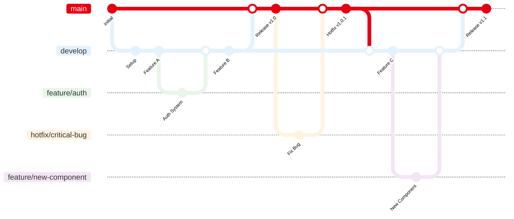

# Full Stack Developer Portfolio


Modern personal portfolio built with JAMstack architecture principles, leveraging static site generation for optimal performance and deployed automatically to Vercel.

## Features

**Core Portfolio Features:**
- Professional first impression with clear value proposition
- Comprehensive project showcase with detailed case studies
- Professional background and skills evaluation system
- Responsive mobile-optimized experience across all devices
- Simple contact system with professional networking links

**User Experience:**
- Intuitive navigation with active section indicators
- Dark/Light theme toggle with system preference detection
- Performance optimized (Lighthouse score > 90)
- Full accessibility compliance (WCAG 2.1 AA)
- SEO optimized with proper meta tags and structured data

**Developer Experience:**
- Live project demonstrations and source code access
- Automated CI/CD pipeline with GitHub Actions
- Type-safe development with TypeScript
- Modern development tooling and best practices

---

## Tech Stack

This portfolio follows JAMstack architecture principles with modern tooling for optimal performance, maintainability, and developer experience:

| **Category** | **Technology** | **Version** | **Role** | **Why This Choice** |
|--------------|----------------|-------------|----------|-------------------|
| **Frontend** | **Next.js** | 15.0 | React framework with App Router | SSG capabilities, performance, modern routing |
| | **React** | 18+ | UI library | Mature ecosystem, reusable components |
| | **Tailwind CSS** | 3+ | Utility-first CSS framework | Rapid development, consistent design system |
| | **Lucide Icons** | Latest | Icon system | Lightweight, optimized SVGs, tree-shaking |
| **Business Logic** | **React Hooks** | - | State management | Simple, performant state handling |
| | **Custom Hooks** | - | Reusable logic | Clean separation of concerns |
| | **ES Modules** | - | Modern JavaScript modules | Native standards, optimization |
| **Development Tools** | **Node.js** | 18+ | JavaScript runtime | npm ecosystem, modern tooling |
| | **pnpm** | 8+ | Package manager | Performance, disk space efficiency |
| | **TypeScript** | 5+ | Typed language | Type safety, better DX |
| | **ESLint + Prettier** | Latest | Code quality | Consistent coding standards |
| **Services & APIs** | **Formspree** | - | Form handling | No backend required, spam protection |
| | **GitHub API** | v4 | Repository data | Dynamic project information |
| | **Vercel Analytics** | - | Performance monitoring | Privacy-friendly, built-in |
| **CI/CD & Deployment** | **GitHub Actions** | - | CI/CD pipeline | Native integration, automated workflows |
| | **Vercel** | - | Hosting and deployment | Edge network, preview deployments |
| | **Git** | - | Version control | Collaboration, history tracking |
| **Content Management** | **Markdown + MDX** | - | Content format | Rich content, component embedding |
| | **JSON** | - | Configuration | Type-safe, easy maintenance |
| | **Git-based CMS** | - | Content management | Version control, developer-friendly |

## Prerequisites

- **Node.js** 18+ (LTS recommended)
- **pnpm** 8+ (package manager)
- **Git** (version control)
- **GitHub Account** (for GitHub Actions)
- **Vercel Account** (for deployment)

## Quick Start

```bash
# Clone repository
git clone https://github.com/sikatikenmogne/portfolio.git
cd portfolio

# Install dependencies
pnpm install

# Start development server
pnpm run dev
# → Open http://localhost:3000

# Build for production
pnpm run build

# Start production server
pnpm run start
```

## Preview

<details>
<summary><strong>Portfolio Screenshots</strong></summary>

### Desktop View


### Mobile View


### Dark Mode


</details>

## Project Structure

```
portfolio/
├── .github/workflows/     # GitHub Actions CI/CD
├── src/
│   ├── app/              # Next.js App Router (pages & layouts)
│   ├── components/       # Reusable React components
│   │   ├── navigation/   # Header, footer, navigation
│   │   ├── projects/     # Project cards, filters, details
│   │   ├── profile/      # About, skills, experience
│   │   ├── contact/      # Contact form, social links
│   │   └── shared/       # Layout, SEO, error boundaries
│   ├── hooks/            # Custom React hooks
│   ├── lib/              # Utility functions and services
│   └── data/             # Configuration and static data
├── content/              # Git-based CMS (Markdown files)
│   ├── projects/         # Project case studies
│   ├── blog/             # Technical articles
│   └── profile/          # About, experience, education
├── public/               # Static assets (images, icons, docs)
├── scripts/              # Build and utility scripts
├── .env.example          # Environment variables template
└── next.config.mjs       # Next.js configuration
```

## Project Status

This portfolio is currently under active development. Some features may be incomplete or under implementation.

### Development Progress

- [ ] User Interface
- [ ] Navigation System
- [ ] Contact Form
- [ ] Dark/Light Theme
- [ ] Projects Showcase
- [ ] Technical Blog
- [ ] Automated Testing
- [ ] Internationalization

**Last Update:** August 2025

## Contributing

This project follows the [Contributor Covenant](https://www.contributor-covenant.org/) code of conduct.
By participating, you are expected to uphold this code.

1. Fork the project
2. Create a branch (`git checkout -b feature/improvement`)
3. Commit (`git commit -m 'feat: add improvement'`)
4. Push (`git push origin feature/improvement`)
5. Open a Pull Request

### Branch Strategy

- **`main`**: Production-ready code, auto-deployed to live site
- **`develop`**: Integration branch, auto-deployed to preview environment
- **`feature/*`**: Feature branches, merged to develop via PR
- **`hotfix/*`**: Critical production fixes, merged directly to main and back to develop

### Development Workflow



## License

This portfolio is licensed under [Creative Commons Attribution 4.0 International License](https://creativecommons.org/licenses/by/4.0/).

See the [LICENSE](LICENSE) file for full details.

## Contact

- **LinkedIn**: [Samuel SIKATI](https://www.linkedin.com/in/samuel-sikati-kenmogne-57953a1b7/)
- **Email**: sikatikenmogne@gmail.com

**Built with ❤️ by [Samuel SIKATI](https://github.com/sikatikenmogne)**
